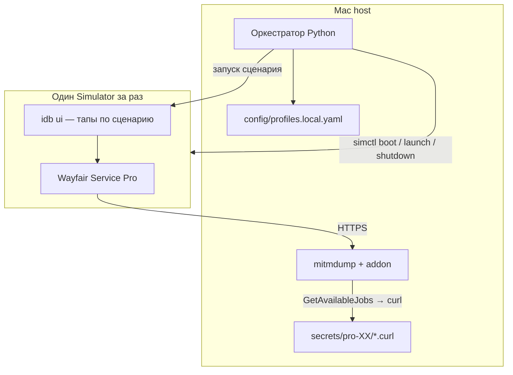

# Итоговый план: автосъём curl GetAvailableJobs на Simulator

Статус: **готов к реализации** (код — следующий этап).

Установку и поддержку IPA на симуляторе (**включая вход в Apple ID / Wayfair**) выполняете **вы**. Этот проект не трогает FairPlay, патч бинарника и переустановку приложения.

## Цель

На Mac (Apple Silicon + Xcode) **по очереди** для каждого профиля:

1. Запустить нужный симулятор.
2. Открыть Wayfair Service Pro.
3. Выполнить короткий UI-сценарий (пара переходов / обновление данных).
4. Перехватить исходящий **POST** `GetAvailableJobs`.
5. Сохранить сырой текст `curl ...` в файл профиля.
6. Остановить симулятор, пауза **1 минута**, следующий профиль; после последнего — снова с первого.

Poll / claim — **другой проект**. Здесь только свежие curl.

## Зафиксированные решения (из ваших ответов)

| Параметр | Значение |
| --- | --- |
| Продукт | Wayfair Service Pro (Wayhome) |
| Формат | Сырой `curl`, перезапись одного файла на профиль |
| Успех | Запрос с `queryName=GetAvailableJobs` |
| Профили | Сначала `pro-01`, затем расширение до ~10 |
| Имена | `pro-01` + модель текстом, без UDID в git |
| Таймзона | Не храним в этом репо |
| Пауза | 60 секунд между профилями |
| Python | Только внутри `venv` |

## Архитектура



### Компоненты

| Модуль | Назначение | Технология |
| --- | --- | --- |
| `orchestrator` | Главный цикл, очередь профилей, паузы, логи | Python 3.11+ |
| `simulator` | `list` / `boot` / `shutdown` / `launch` / ожидание готовности | `xcrun simctl` |
| `proxy` | Локальный перехват HTTPS, фильтр wayfair | `mitmproxy` (mitmdump + addon) |
| `capture` | Из flow → строка `curl` с заголовками и телом | addon на Python |
| `ui` | Тапы / свайпы по записанному сценарию | `idb` (`idb ui tap`, `idb ui swipe`) |
| `storage` | Атомарная запись curl + `meta.json` (время, без токенов в git) | файловая система |
| `config` | Профили, UDID, модель, bundle id, шаги UI | YAML |

## Что делаете вы (один раз на профиль)

1. **Создать симулятор** нужной модели iPhone (через Xcode → Devices or `simctl create`).
2. **Установить IPA** и войти в App Store / Wayfair (вручную).
3. **Доверить CA прокси** на этом симуляторе (см. раздел «Прокси»).
4. **Записать UI-сценарий**: координаты тапов под размер экрана этой модели (скриншот + `idb ui describe` / ручная запись).
5. Прописать **UDID** и шаги в локальный конфиг (`config/profiles.local.yaml`, в git не коммитится).

Bundle id после установки проверить:

```bash
xcrun simctl listapps booted | grep -i wayfair
```

Ожидаемо: `com.wayfair.WayHome` (регистр уточнить по факту).

## Прокси и перехват

Симулятор **не имеет своих** настроек HTTP-прокси — использует прокси macOS ([документация mitmproxy](https://docs.mitmproxy.org/stable/concepts/certificates/), [гайд по Simulator](https://alwold.com/posts/using-mitmproxy-with-ios-simulator/)).

### Однократная настройка на симулятор

```bash
# mitmproxy уже запускался хотя бы раз — есть ~/.mitmproxy/mitmproxy-ca-cert.pem
xcrun simctl boot <UDID>
xcrun simctl keychain booted add-root-cert ~/.mitmproxy/mitmproxy-ca-cert.pem
```

Системный прокси Mac (пример для Wi‑Fi; имя интерфейса уточнить через `networksetup -listallnetworkservices`):

```bash
networksetup -setwebproxy "Wi-Fi" 127.0.0.1 8080
networksetup -setsecurewebproxy "Wi-Fi" 127.0.0.1 8080
```

После работы скрипт **снимает** прокси (чтобы не ломать обычный браузер), либо вы включаете это в `settings.yaml`.

### Фильтр трафика

В `mitmproxy` addon:

- хост: `www.wayfair.com` (и при необходимости `secure.wayfair.com`);
- метод: `POST`;
- URL содержит: `queryName=GetAvailableJobs` (или `queryHash=7632b54fcfa7cd10bec94e6cda6236bf`).

При совпадении — собрать curl:

```bash
curl 'https://www.wayfair.com/wayhome/graphql?...' \
  -X POST \
  -H 'Authorization: Bearer …' \
  -H 'Cookie: …' \
  … \
  --data-raw '{"hash":"…","variables":{…}}'
```

Записать в `secrets/<profile_id>/get_available_jobs.curl` атомарно (сначала `.tmp`, затем `rename`).

### Ограничение (важно)

Если приложение использует **certificate pinning**, перехват не заработает без обхода pinning. Вы уже снимаете curl с **живого iPhone** (ответ 17A) — значит, на вашей связке Charles/Proxyman это возможно. На симуляторе должно быть **то же**: доверенный CA, без инструкций по Frida/ssl-kill-switch в этом репозитории.

Заголовки `X-PX-*` по-прежнему **короткоживущие** — это норма; задача этого проекта — регулярно обновлять файл curl, а не «вечный» токен.

## UI-автоматизация

Исходников приложения нет → **координатный сценарий** через `idb`, привязанный к модели экрана профиля.

Пример `config/ui/pro-01.yaml`:

```yaml
# После launch — подождать splash
- action: sleep
  seconds: 8
# Вкладка «Available» / список заказов — координаты под iPhone 15
- action: tap
  x: 120
  y: 780
- action: sleep
  seconds: 2
# Pull-to-refresh или кнопка обновления
- action: swipe
  x1: 200
  y1: 300
  x2: 200
  y2: 600
  duration_ms: 400
- action: sleep
  seconds: 5
```

Запись координат (разово на Mac):

```bash
idb ui describe --json  # accessibility-дерево
idb ui tap 120 780
```

При смене версии приложения сценарий, скорее всего, придётся подправить — это ожидаемая хрупкость.

**Альтернатива** (фаза 2, если idb неудобен): Appium + XCUITest-драйвер — тяжелее в установке, чуть устойчивее к accessibility-лейблам, если они есть у кнопок.

## Главный цикл (псевдокод)

```text
загрузить profiles из profiles.local.yaml
загрузить state (индекс очереди) из data/state.json
запустить mitmdump с addon в фоне
включить системный прокси Mac

бесконечно:
    profile = profiles[state.index]
    try:
        simctl boot(profile.simulator_udid)
        simctl launch(profile.simulator_udid, profile.bundle_id)
        выполнить ui_steps(profile)
        ждать capture.wait(profile_id, timeout=90s)
        если не поймали → ошибка в лог, profile.status=failed
        simctl shutdown(profile.simulator_udid)
    except:
        лог + simctl shutdown (best effort)
    state.index = (state.index + 1) % len(profiles)
    сохранить state
    sleep(60)

finally:
    выключить прокси
    остановить mitmdump
```

На старте (**24C**) в списке один профиль `pro-01`; остальные добавляете в конфиг по мере готовности симуляторов.

## Структура репозитория (целевая)

```text
.
├── README.md
├── requirements.txt
├── .env.example
├── config/
│   ├── settings.example.yaml      # порт mitm, пауза, таймауты
│   ├── profiles.example.yaml      # шаблон без UDID
│   └── ui/
│       └── pro-01.example.yaml    # пример сценария
├── src/
│   └── wayfire_sim/
│       ├── __init__.py
│       ├── __main__.py            # python -m wayfire_sim
│       ├── orchestrator.py
│       ├── simulator.py
│       ├── proxy.py
│       ├── capture_addon.py       # логика mitm addon
│       ├── ui_runner.py
│       ├── curl_builder.py
│       └── storage.py
├── secrets/                       # gitignore — живые curl
│   └── pro-01/
│       ├── get_available_jobs.curl
│       └── meta.json              # updated_at, ok/fail — без секретов
└── data/
    └── state.json                 # gitignore — индекс очереди
```

Локальные файлы (gitignore):

- `config/profiles.local.yaml` — UDID и привязка к `pro-XX`
- `config/profiles.local.yaml` копируется с `profiles.example.yaml`

## Конфиг профиля (пример)

```yaml
# config/profiles.example.yaml
profiles:
  - id: pro-01
    label: "Иван / iPhone 15"
    device_model: "iPhone 15"          # только подпись
    simulator_udid: "ЗАМЕНИТЬ-ЛОКАЛЬНО" # в profiles.local.yaml
    bundle_id: "com.wayfair.WayHome"   # проверить после установки IPA
    ui_scenario: "config/ui/pro-01.yaml"
    enabled: true
```

## Запуск (после реализации)

```bash
python3 -m venv .venv
source .venv/bin/activate
pip install -r requirements.txt

cp config/profiles.example.yaml config/profiles.local.yaml
cp config/settings.example.yaml config/settings.yaml
# отредактировать UDID, ui-сценарий

python -m wayfire_sim run
```

Зависимости на Mac (вне pip): **Xcode**, **idb** (`brew install idb-companion` + pip `fb-idb` или CLI idb).

## Фазы реализации

| Фаза | Содержание | Критерий готовности |
| --- | --- | --- |
| **0** | Вы: IPA, логин, CA, UDID, координаты UI | Вручную один успешный curl в Charles на этом симуляторе |
| **1** | Каркас: venv, конфиги, `curl_builder`, `storage` | Юнит-тест сборки curl из mock-request |
| **2** | `capture_addon` + `proxy` | mitmdump ловит GetAvailableJobs с тестового curl через симулятор/Safari |
| **3** | `simulator` + `orchestrator` без UI | boot → launch → shutdown по конфигу |
| **4** | `ui_runner` + сценарий pro-01 | После тапов уходит GetAvailableJobs |
| **5** | Полный цикл + пауза 60 с + state | Файл `secrets/pro-01/get_available_jobs.curl` обновляется автоматически |
| **6** | Добавление pro-02 … pro-10 | Только конфиг + UI yaml + ваш setup симулятора |

## Риски и смягчение

| Риск | Смягчение |
| --- | --- |
| Pinning блокирует HTTPS | Проверка на фазе 0 вручную; без обхода в коде |
| Сломались координаты после обновления app | Версия app в `meta.json`, отдельный ui yaml на версию |
| Симулятор завис | Таймаут boot/launch; `simctl shutdown` + retry 1 раз |
| Системный прокси мешает Mac | Скрипт включает/выключает прокси только на время цикла |
| RAM при 10 симуляторах | Всегда **один** booted — уже в требованиях |
| Два GraphQL подряд | Брать **последний** GetAvailableJobs за сессию или с самым свежим `Authorization` |

## Что сознательно не входит в проект

- Установка / патч / расшифровка IPA.
- Обход certificate pinning (Frida, ssl-kill-switch, патч IPA).
- Poll / claim / `fabric.py`.
- Хранение паролей Apple ID / Wayfair (сессия уже в приложении после вашего входа).

## Следующий шаг

После вашего подтверждения плана — **фаза 1–2**: `requirements.txt`, каркас `src/wayfire_sim/`, примеры конфигов, `capture_addon` и `curl_builder`.
